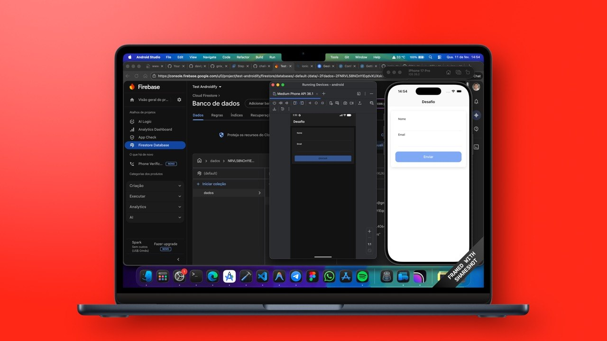

# Challenge Ionic V2

Aplicativo de demonstração Ionic + Angular + Capacitor com integração ao Firebase (Firestore).

**Resumo**

- App: formulário simples que salva dados no Firestore e captura geolocalização.
- Tecnologias: Ionic 8 / Angular 20 / Capacitor 8 / @angular/fire + Firebase v12+

**Pré-requisitos**

- Node.js >= 18
- npm ou pnpm
- Ionic CLI: `npm i -g @ionic/cli`
- Capacitor CLI: já incluído nas devDependencies (`@capacitor/cli`)
- Java JDK (recomendado Java 17 ou 21). Atenção: JDKs muito novos (ex.: 25) podem causar incompatibilidades com versões do Gradle.
- Android Studio (para emulador / build Android)
- Xcode (para iOS, macOS)
- CocoaPods (`sudo gem install cocoapods`) — _Opcional se usar SPM (Swift Package Manager)_, mas recomendado para plugins legados.

**Instalação local**

- Instale dependências: `npm install`
- Configure Firebase: abra [src/environments/environment.ts](src/environments/environment.ts) e atualize o bloco `firebase` com suas credenciais do projeto Firebase.

**Rodando em desenvolvimento (web)**

- `ionic serve` — roda no navegador

**iOS (Configuração e Build)**

O projeto está configurado para usar **Swift Package Manager (SPM)** como gerenciador de dependências nativas (Capacitor 8+).

1.  **Sincronizar**: `npx cap sync ios`
2.  **Abrir no Xcode**: `npx cap open ios`
3.  **Configurações Importantes**:
    - No Xcode, vá em **Signing & Capabilities** e selecione seu "Team" para possibilitar o build em dispositivos físicos.
    - O `Info.plist` já contém as chaves necessárias para geolocalização:
      - `NSLocationAlwaysUsageDescription`
      - `NSLocationWhenInUseUsageDescription`
4.  **Executar**:
    - Via CLI: `npx cap run ios`
    - Pelo Xcode: Botão **Play** (Cmd+R) após selecionar o simulador ou dispositivo.

**Android (Configuração e Build)**

1.  **Sincronizar**: `npx cap sync android`
2.  **Abrir no Android Studio**: `npx cap open android`
3.  **Executar**: `npx cap run android` ou via Android Studio.

**Build (produção)**

- `npm run build` (gera `www`) && `npx cap sync android` && então build via Android Studio / Xcode

**Firebase / Firestore**

- Este projeto usa `@angular/fire` + Firebase modular (v9+). O módulo é inicializado em `src/app/app.module.ts`.
- Serviço de exemplo: `src/app/services/desafio.ts` — usa injeção do `Firestore` e funções `collection`, `addDoc`, `updateDoc`.

**Configurações Capacitor (CORS / WebView)**

- Se a WebView bloquear requisições ao Firestore (erro `net::ERR_BLOCKED_BY_CLIENT`), atualize `capacitor.config.ts` adicionando hosts do Firebase em `server.allowNavigation` e sincronize: `npx cap sync`.

**Problemas comuns e correções aplicadas**

- `ion-app` não é conhecido: adicione `CUSTOM_ELEMENTS_SCHEMA` em `src/app/app.module.ts` (já aplicado).
- `Can't bind to 'formGroup'`: importe `ReactiveFormsModule` no módulo da página (ex.: `src/app/home/home.module.ts`).
- Erros `TS4111` (index signature): no template use `fields['nome'].errors['required']` em vez de `fields.nome.errors.required`.
- Import de `ToastController` incorreta: use `import { ToastController } from '@ionic/angular';`.
- `Firebase API called outside injection context`: certifique-se de definir `provideFirebaseApp` e `provideFirestore` em `imports` de `AppModule` e usar injeção (ou `inject()`), como feito em `src/app/services/desafio.ts`.
- Erro Gradle / Java (`Unsupported class file major version 69`): ajuste sua JDK para uma versão suportada pelo Gradle ou defina `org.gradle.java.home` em `android/gradle.properties` apontando para a JDK desejada.

**Comandos úteis**

- `npm install`
- `ionic serve`
- `npx cap sync`
- `npx cap run android`
- `npx cap open android`
- `npm run build`
- `npm test`

**Continuação / Contribuição**

- Se quiser, eu posso: rodar e ajustar scripts de build, preparar workflow CI, adicionar validação / testes de ponta a ponta, ou preparar o deploy no Firebase Hosting.

---

Gerado automaticamente — instruções e correções básicas incluídas para facilitar o build e execução do app.
